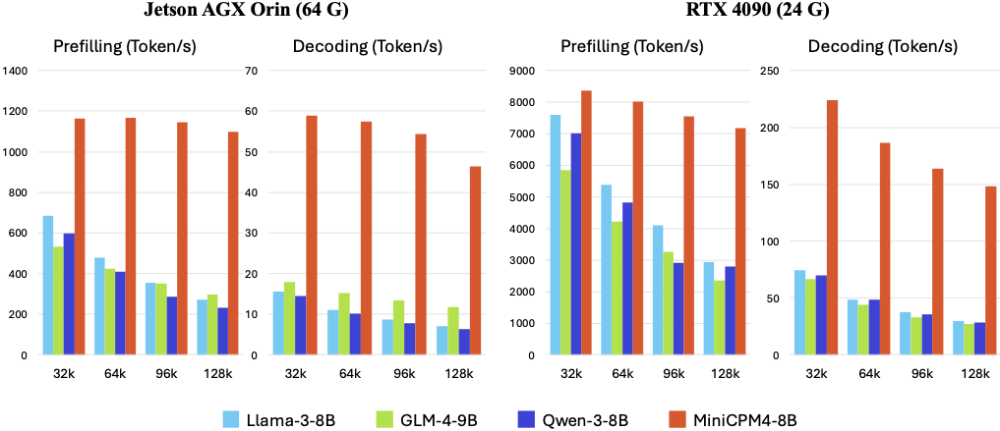
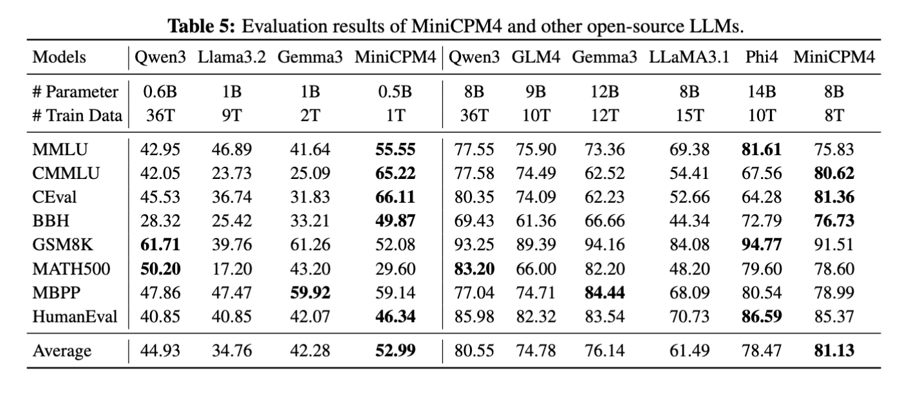
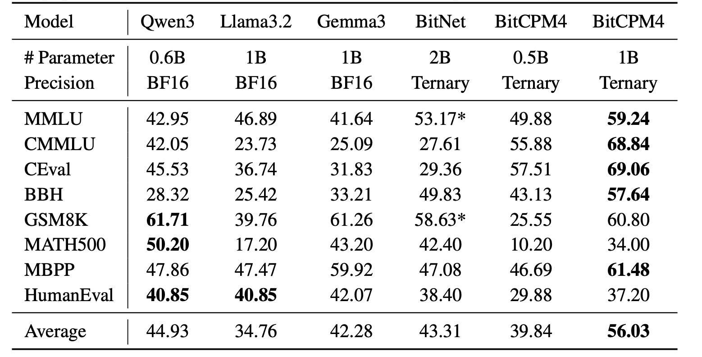
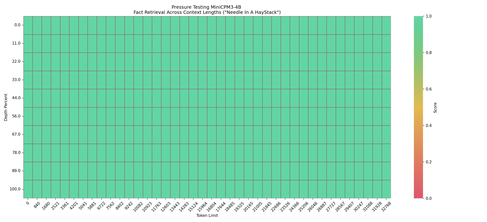

<div align="center">
</img> 
</div>

<h4 align="center">
    <p>
        <b>中文</b> | <a href="https://github.com/OpenBMB/MiniCPM/blob/main/README-en.md">English</a>
    <p>
</h4>


<p align="center">
<a href="https://openbmb.vercel.app/?category=Chinese+Blog" target="_blank">MiniCPM 技术博客</a> |
<a href="https://modelbest.feishu.cn/wiki/D2tFw8Pcsi5CIzkaHNacLK64npg" target="_blank">MiniCPM 知识库</a> |
<a href="https://arxiv.org/abs/2404.06395" target="_blank">MiniCPM 论文</a> |
<a href="https://github.com/OpenBMB/MiniCPM-V/" target="_blank">MiniCPM-V 仓库</a> |
加入我们的 <a href="https://discord.gg/3cGQn9b3YM" target="_blank">discord</a> 和 <a href="https://github.com/OpenBMB/MiniCPM/blob/main/assets/wechat.jpg" target="_blank">微信群</a>
 
</p>

## 更新日志🔥
- [2025.06.06] 发布[**MiniCPM4**]([https:/](https://huggingface.co/openbmb/MiniCPM4-8B))！该模型在保持同等规模最优性能的同时，实现了极致的效率提升！在典型端侧芯片上能够实现5倍以上生成加速！
- [2024.09.28] **[LLMxMapReduce](https://github.com/thunlp/LLMxMapReduce)** 开源，支持MiniCPM3-4B，理论上支持无限长文本输入！
- [2024.09.18] **[SGLang](https://github.com/sgl-project/sglang) 已经支持 MiniCPM3-4B (推荐使用)！由于 SGLang v0.3 对 MiniCPM3 中使用的 MLA 结构进行了推理优化，吞吐量相比于 vLLM 提高 70%！**[[用法](#sglang推荐)]
- [2024.09.16] [llama.cpp](https://github.com/ggerganov/llama.cpp/releases/tag/b3765) 已经官方支持 MiniCPM3-4B！[[GGUF模型](https://huggingface.co/openbmb/MiniCPM3-4B-GGUF)|[用法](#llamacpp)]
- [2024.09.05] 发布 [**MiniCPM3-4B**](https://huggingface.co/openbmb/MiniCPM3-4B)！该模型的表现超越 Phi-3.5-mini-instruct 和 GPT-3.5-Turbo-0125，并且能够比肩 Llama3.1-8B-Instruct、Qwen2-7B-Instruct、GLM-4-9B-Chat 等多个 7B-9B 参数量的模型。
- [2024.07.09] MiniCPM-2B 已经支持使用 [SGLang](#sglang-推理) 推理！
- [2024.07.05] 发布 [MiniCPM-S-1B](https://huggingface.co/openbmb/MiniCPM-S-1B-sft)！该模型在保持下游任务性能无损的前提下，FFN 层实现了 87.89% 的平均稀疏度，将 FFN FLOPs 降低了 84%。
- [2024.04.11] 发布 [MiniCPM-2B-128k](https://huggingface.co/openbmb/MiniCPM-2B-128k)、[MiniCPM-MoE-8x2B](https://huggingface.co/openbmb/MiniCPM-MoE-8x2B) 和 [MiniCPM-1B](https://huggingface.co/openbmb/MiniCPM-1B-sft-bf16)！点击[这里](https://openbmb.vercel.app/?category=Chinese+Blog)查看技术博客。
- [2024.03.16] MiniCPM-2B 的 30 余个中间检查点开放了！[HuggingFace链接](https://huggingface.co/openbmb/MiniCPM-2B-history)
- [2024.02.01] 发布 [**MiniCPM-2B**](https://huggingface.co/openbmb/MiniCPM-2B-sft-bf16)！该模型在公开评测集上与 Mistral-7B 表现相近（中文、数学、代码能力更优），整体性能超越 Llama2-13B、MPT-30B、Falcon-40B 等模型。

## 目录

- [更新日志🔥](#更新日志)
- [目录](#目录)
- [模型下载](#模型下载)
- [MiniCPM 4.0](#minicpm-40)
  - [评测结果](#评测结果)
    - [效率评测](#效率评测)
    - [综合评测](#综合评测)
    - [长文本评测](#长文本评测)
  - [BitCPM4: 模型量化](#bitcpm4-模型量化)
    - [BitCPM4评测](#bitcpm4评测)
    - [BitCPM4模型推理](#bitcpm4模型推理)
  - [模型应用](#模型应用)
    - [MiniCPM4-Survey: 综述生成](#minicpm4-survey-综述生成)
    - [MiniCPM4-MCP: MCP增强的工具调用](#minicpm4-mcp-mcp增强的工具调用)
  - [模型推理](#模型推理)
    - [CPM.cu](#cpmcu)
    - [HuggingFace](#huggingface)
    - [vLLM](#vllm)
    - [SGLang](#sglang)
    - [llama.cpp](#llamacpp)
  - [模型微调](#模型微调)
    - [LLaMA-Factory](#llama-factory)
    - [XTuner](#xtuner)
- [MiniCPM 3.0](#minicpm-30)
- [MiniCPM 2.0](#minicpm-20)
- [MiniCPM 1.0](#minicpm-10)
- [开源协议](#开源协议)
- [开发机构](#开发机构)
- [工作引用](#工作引用)


## 模型下载
 
  | HuggingFace | ModelScope |
  |-------------|------------|
  | [MiniCPM4-8B](https://huggingface.co/openbmb/MiniCPM4-8B)    | [MiniCPM4-8B](https://www.modelscope.cn/models/OpenBMB/MiniCPM4-8B) |
  | [MiniCPM4-0.5B](https://huggingface.co/openbmb/MiniCPM4-0.5B) | [MiniCPM4-0.5B](https://www.modelscope.cn/models/OpenBMB/MiniCPM4-0.5B) |
  | [BitCPM4-1B](https://huggingface.co/openbmb/BitCPM4-1B)        | [BitCPM4-1B](https://www.modelscope.cn/models/OpenBMB/BitCPM4-1B) |
  | [BitCPM4-0.5B](https://huggingface.co/openbmb/BitCPM4-0.5B)    | [BitCPM4-0.5B](https://www.modelscope.cn/models/OpenBMB/BitCPM4-0.5B) |
  | [MiniCPM4-Survey](https://huggingface.co/openbmb/MiniCPM4-Survey) | [MiniCPM4-Survey](https://www.modelscope.cn/models/OpenBMB/MiniCPM4-Survey) |
  | [MiniCPM4-MCP](https://huggingface.co/openbmb/MiniCPM4-MCP)  | [MiniCPM4-MCP](https://www.modelscope.cn/models/OpenBMB/MiniCPM4-MCP) |
  |[MiniCPM3-4B](https://huggingface.co/openbmb/MiniCPM3-4B)|[MiniCPM3-4B](https://www.modelscope.cn/models/OpenBMB/MiniCPM3-4B)|
  |[MiniCPM-2B-sft](https://huggingface.co/openbmb/MiniCPM-2B-sft-bf16)|[MiniCPM-2B-sft](https://modelscope.cn/models/OpenBMB/miniCPM-bf16)|
  |[MiniCPM-2B-dpo](https://huggingface.co/openbmb/MiniCPM-2B-dpo-bf16)|[MiniCPM-2B-dpo](https://modelscope.cn/models/OpenBMB/MiniCPM-2B-dpo-bf16/summary)|
  |[MiniCPM-2B-128k](https://huggingface.co/openbmb/MiniCPM-2B-128k) |[MiniCPM-2B-128k](https://modelscope.cn/models/openbmb/MiniCPM-2B-128k/summary)| 
  |[MiniCPM-MoE-8x2B](https://huggingface.co/openbmb/MiniCPM-MoE-8x2B) |[MiniCPM-MoE-8x2B](https://modelscope.cn/models/OpenBMB/MiniCPM-MoE-8x2B)| 
  |[MiniCPM-1B](https://huggingface.co/openbmb/MiniCPM-1B-sft-bf16) | [MiniCPM-1B](https://modelscope.cn/models/OpenBMB/MiniCPM-1B-sft-bf16) |
  |[MiniCPM-S-1B](https://huggingface.co/openbmb/MiniCPM-S-1B-sft)|[MiniCPM-S-1B](https://modelscope.cn/models/OpenBMB/MiniCPM-S-1B-sft)|

  注: 更多模型版本见[这里](https://huggingface.co/collections/openbmb/minicpm-2b-65d48bf958302b9fd25b698f)。

## MiniCPM 4.0
MiniCPM 4 是一个极致高效的端侧大模型，从模型架构、学习算法、训练数据与推理系统四个层面进行了高效优化，实现了极致的效率提升。
- 🏗️ 高效模型架构：
  - InfLLM v2 -- 可训练的稀疏注意力机制：采用可训练的稀疏注意力机制架构，在128K长文本处理中，每个词元仅需与不足5%的词元进行相关性计算，显著降低长文本的计算开销
- 🧠 高效学习算法：
  - 模型风洞2.0 -- 高效Predictable Scaling：引入下游任务的Scaling预测方法，实现更精准的模型训练配置搜索
  - BitCPM -- 极致的三值量化：将模型参数位宽压缩至3值，实现模型体积90%的极致瘦身
  - 高效训练工程优化：采用FP8低精度计算技术，结合多词元预测（Multi-token Prediction）训练策略
- 📚 高知识密度训练数据：
  - UltraClean -- 高质量预训练数据的清洗与合成：构建基于高效验证的迭代式数据清洗策略，开源高质量中英文预训练数据集 [UltraFineweb](https://huggingface.co/datasets/openbmb/Ultra-FineWeb)
  - UltraChat v2 -- 高质量有监督微调数据合成：构建大规模高质量有监督微调数据集，涵盖知识密集型数据、推理密集型数据、指令遵循数据、长文本理解数据、工具调用数据等多个维度
- ⚡ 高效推理系统：
  - FRSpec -- 轻量级投机采样：通过对草稿模型词表的智能裁剪，实现草稿模型的生成加速优化
  - ArkInfer -- 跨平台部署系统：支持多后端环境的一键部署，提供灵活的跨平台适配能力

### 评测结果
#### 效率评测
在Jetson AGX Orin和RTX 4090两款典型端侧芯片上，MiniCPM4在长文本处理任务中展现出大幅领先同尺寸模型的处理速度。随着文本长度的增加，MiniCPM4的性能优势愈发显著。在Jetson AGX Orin平台上，相较于Qwen3-8B，MiniCPM4实现了约7倍的生成速度提升。



#### 综合评测
MiniCPM4推出端侧8B、0.5B两种参数规模版本，均在同级别模型中实现了最佳性能表现。


#### 长文本评测
MiniCPM4基于32K长文本进行预训练，并通过YaRN技术实现长度扩展。在128K长文本的大海捞针任务中，MiniCPM4展现出卓越的性能表现。


### BitCPM4: 模型量化
BitCPM4是基于MiniCPM系列模型进行量化感知训练（QAT）后得到的三值量化模型，在训练效率和模型参数效率实现了有效的提升。
- 训练方法改进
  - 在小规模模型上进行风洞实验，搜索训练所需的训练超参。
  - 通过使用一阶段高精训练+二阶段QAT的方法，充分利用已经完成或部分完成训练的高精度模型，极大地压缩了QAT阶段所需要的算力。
- 高效参数效率
  - 模型使用1.58Bit的位宽达到的性能对标与同参数量级别的全精度模型，模型参数效率高。

#### BitCPM4评测
BitCPM4在测试中的表现可以对标同级别的业界主流全精度模型。


#### BitCPM4模型推理
BitCPM4开源的模型参数为伪量化形式，可以直接使用Huggingface框架进行推理。

### 模型应用

#### MiniCPM4-Survey: 综述生成
MiniCPM4-Survey是由[THUNLP](https://nlp.csai.tsinghua.edu.cn)、中国人民大学和[ModelBest](https://modelbest.cn/en)联合开发的开源大语言模型智能体。它基于[MiniCPM4](https://github.com/OpenBMB/MiniCPM4) 80亿参数基座模型，接受用户质量作为输入，自主生成可信的长篇综述论文。
主要特性包括：
- 计划-检索-写作生成框架 — 我们提出了一个多智能体生成框架，包含三个核心阶段：计划（定义综述的整体结构）、检索（生成合适的检索关键词）和写作（利用检索到的信息，生成连贯的段落）。
- 高质量数据集构建——我们收集并处理大量人类专家写作的综述论文，构建高质量训练集。同时，我们收集大量研究论文，构建检索数据库。
- 多方面奖励设计 — 我们精心设计了包含结构、内容和引用的奖励，用于评估综述的质量，在强化学习训练阶段作奖励函数。
- 多步强化学习训练策略 — 我们提出了一个上下文管理器，以确保在促进有效推理的同时保留必要的信息，并构建了并行环境，维持强化学习训练高效。
##### 使用与演示案例

详见[此处](./demo/minicpm4/SurveyGeneration/README.md)

##### 评估

| Method                                      | Relevance | Coverage | Depth | Novelty | Avg.  | Fact Score |
|---------------------------------------------|-----------|----------|-------|---------|-------|------------|
| Naive RAG (driven by G2FT)                  | 3.25      | 2.95     | 3.35  | 2.60    | 3.04  | 43.68      |
| AutoSurvey (driven by G2FT)                 | 3.10      | 3.25     | 3.15  | **3.15**| 3.16  | 46.56      |
| Webthinker (driven by WTR1-7B)              | 3.30      | 3.00     | 2.75  | 2.50    | 2.89  | --         |
| Webthinker (driven by QwQ-32B)              | 3.40      | 3.30     | 3.30  | 2.50    | 3.13  | --         |
| OpenAI Deep Research (driven by GPT-4o)     | 3.50      |**3.95**  | 3.55  | 3.00    | **3.50**  | --         |
| MiniCPM4-Survey                            | 3.45      | 3.70     | **3.85** | 3.00    | **3.50**  | **68.73**  |
| &nbsp;&nbsp;&nbsp;*w/o* RL                  | **3.55**  | 3.35     | 3.30  | 2.25    | 3.11  | 50.24      |

*GPT-4o对综述生成系统的性能比较。“G2FT”代表Gemini-2.0-Flash-Thinking，“WTR1-7B”代表Webthinker-R1-7B。由于Webthinker不包括引用功能，OpenAI Deep Research在导出结果时不提供引用，因此省略了对它们的FactScore评估。我们的技术报告中包含评测的详细信息。*

#### MiniCPM4-MCP: MCP增强的工具调用
  
### 模型推理

#### CPM.cu

我们推荐使用 [CPM.cu](https://github.com/OpenBMB/cpm.cu) 对 MiniCPM4 模型进行推理。CPM.cu 是面壁开发的一个集合了高效稀疏、投机采样、量化等技术的 CUDA 推理框架，能够完全发挥 MiniCPM4 的效率优势。

你可以通过以下脚本安装 CPM.cu 并进行推理：

```bash
git clone https://github.com/OpenBMB/cpm.cu.git --recursive
cd cpm.cu
python3 setup.py install
```

MiniCPM4 原生支持 32,768 tokens 的上下文长度。为了复现论文中的长文本加速效果，我们推荐使用我们已验证通过的LongRoPE因子，修改方法：在`config.json`文件中调整`rope_scaling`字段参数即可。

```json
{
    ...,
    "rope_scaling": {
        "rope_type": "longrope", 
        "long_factor": [0.9977997200264581, 1.014658295992452, 1.0349680404997148, 1.059429246056193, 1.0888815016813513, 1.1243301355211495, 1.166977103606075, 1.2182568066927284, 1.2798772354275727, 1.3538666751582975, 1.4426259039919596, 1.5489853358570191, 1.6762658237220625, 1.8283407612492941, 2.0096956085876183, 2.225478927469756, 2.481536379650452, 2.784415934557119, 3.1413289096347365, 3.560047844772632, 4.048719380066383, 4.752651957515948, 5.590913044973868, 6.584005926629993, 7.7532214876576155, 9.119754865903639, 10.704443927019176, 12.524994176518703, 14.59739595363613, 16.93214476166354, 19.53823297353041, 22.417131025031697, 25.568260840911098, 28.991144156566317, 32.68408069090375, 36.65174474170465, 40.90396065611201, 45.4664008671033, 50.37147343433591, 55.6804490772103, 61.470816952306556, 67.8622707390618, 75.00516023410414, 83.11898235973767, 92.50044360202462, 103.57086856690864, 116.9492274587385, 118.16074567836519, 119.18497548708795, 120.04810876261652, 120.77352815196981, 121.38182790207875, 121.89094985353891, 122.31638758099915, 122.6714244963338, 122.9673822552567, 123.21386397019609, 123.41898278254268, 123.58957065488238, 123.73136519024158, 123.84917421274221, 123.94701903496814, 124.02825801299717, 124.09569231686116],
        "short_factor": [0.9977997200264581, 1.014658295992452, 1.0349680404997148, 1.059429246056193, 1.0888815016813513, 1.1243301355211495, 1.166977103606075, 1.2182568066927284, 1.2798772354275727, 1.3538666751582975, 1.4426259039919596, 1.5489853358570191, 1.6762658237220625, 1.8283407612492941, 2.0096956085876183, 2.225478927469756, 2.481536379650452, 2.784415934557119, 3.1413289096347365, 3.560047844772632, 4.048719380066383, 4.752651957515948, 5.590913044973868, 6.584005926629993, 7.7532214876576155, 9.119754865903639, 10.704443927019176, 12.524994176518703, 14.59739595363613, 16.93214476166354, 19.53823297353041, 22.417131025031697, 25.568260840911098, 28.991144156566317, 32.68408069090375, 36.65174474170465, 40.90396065611201, 45.4664008671033, 50.37147343433591, 55.6804490772103, 61.470816952306556, 67.8622707390618, 75.00516023410414, 83.11898235973767, 92.50044360202462, 103.57086856690864, 116.9492274587385, 118.16074567836519, 119.18497548708795, 120.04810876261652, 120.77352815196981, 121.38182790207875, 121.89094985353891, 122.31638758099915, 122.6714244963338, 122.9673822552567, 123.21386397019609, 123.41898278254268, 123.58957065488238, 123.73136519024158, 123.84917421274221, 123.94701903496814, 124.02825801299717, 124.09569231686116],
        "original_max_position_embeddings": 32768
    }
}
```

修改完成后，你可以通过以下命令进行推理，复现论文中的长文本加速效果 (运行脚本会自动从 HuggingFace 下载模型权重)

```bash
python3 tests/test_generate.py
```

更多关于 CPM.cu 的细节，请参考 [CPM.cu 仓库](https://github.com/OpenBMB/cpm.cu)。

#### HuggingFace

```python
from transformers import AutoModelForCausalLM, AutoTokenizer
import torch
path = "openbmb/MiniCPM4-8B"
device = "cuda"
tokenizer = AutoTokenizer.from_pretrained(path, trust_remote_code=True)
model = AutoModelForCausalLM.from_pretrained(path, torch_dtype=torch.bfloat16, device_map=device, trust_remote_code=True)
messages = [
    {"role": "user", "content": "推荐5个北京的景点。"},
]
model_inputs = tokenizer.apply_chat_template(messages, return_tensors="pt", add_generation_prompt=True).to(device)
model_outputs = model.generate(
    model_inputs,
    max_new_tokens=1024,
    top_p=0.7,
    temperature=0.7
)
output_token_ids = [
    model_outputs[i][len(model_inputs[i]):] for i in range(len(model_inputs))
]
responses = tokenizer.batch_decode(output_token_ids, skip_special_tokens=True)[0]
print(responses)
```
本模型支持稀疏注意力机制 InfLLM v2，可高效处理长序列推理。如需启用该功能，请先安装依赖库[infllmv2_cuda_impl](https://github.com/suhmily10/infllmv2_cuda_impl)


运行以下命令即可安装：

```bash
git clone -b feature_infer https://github.com/suhmily10/infllmv2_cuda_impl.git
cd infllmv2_cuda_impl
git submodule update --init --recursive
pip install -e . # or python setup.py install 

```


启用 InfLLM v2 需在`config.json`配置文件中添加`sparse_config`字段：

```json
{
    ...,
    "sparse_config": {
        "kernel_size": 32,
        "kernel_stride": 16,
        "init_blocks": 1,
        "block_size": 64,
        "window_size": 2048,
        "topk": 64,
        "use_nope": false,
        "dense_len": 8192
    }
}
```

这些参数控制 InfLLM v2 的行为:

* `kernel_size`（默认值：32）：语义核的大小。  

* `kernel_stride`（默认值：16）：相邻语义核的步长。  

* `init_blocks`（默认值：1）：每个query token关注的初始的块数量，用于确保关注序列开头部分。  

* `block_size`（默认值：64）：key-value blocks 的块大小。  

* `window_size`（默认值：2048）：局部滑动窗口大小。  

* `topk`（默认值：64）：每个token仅与最相关的top-k个 key-value blocks 计算注意力。  

* `use_nope`（默认值：false）：是否在块选择中使用NOPE技术以提升性能。  

* `dense_len`（默认值：8192）：稀疏注意力对短序列收益有限，当token长度低于此阈值时自动切换为标准注意力。设为`-1`则强制始终使用稀疏注意力。


Minicpm4原生支持32,768 tokens的上下文长度。若对话总长度（输入+输出）远超此限制，建议通过RoPE缩放技术扩展上下文。我们已验证通过调整LongRoPE因子，模型可稳定支持131,072 tokens的超长上下文。

修改方法：在`config.json`文件中调整`rope_scaling`字段参数即可。

```json
{
    ...,
    "rope_scaling": {
        "rope_type": "longrope", 
        "long_factor": [0.9977997200264581, 1.014658295992452, 1.0349680404997148, 1.059429246056193, 1.0888815016813513, 1.1243301355211495, 1.166977103606075, 1.2182568066927284, 1.2798772354275727, 1.3538666751582975, 1.4426259039919596, 1.5489853358570191, 1.6762658237220625, 1.8283407612492941, 2.0096956085876183, 2.225478927469756, 2.481536379650452, 2.784415934557119, 3.1413289096347365, 3.560047844772632, 4.048719380066383, 4.752651957515948, 5.590913044973868, 6.584005926629993, 7.7532214876576155, 9.119754865903639, 10.704443927019176, 12.524994176518703, 14.59739595363613, 16.93214476166354, 19.53823297353041, 22.417131025031697, 25.568260840911098, 28.991144156566317, 32.68408069090375, 36.65174474170465, 40.90396065611201, 45.4664008671033, 50.37147343433591, 55.6804490772103, 61.470816952306556, 67.8622707390618, 75.00516023410414, 83.11898235973767, 92.50044360202462, 103.57086856690864, 116.9492274587385, 118.16074567836519, 119.18497548708795, 120.04810876261652, 120.77352815196981, 121.38182790207875, 121.89094985353891, 122.31638758099915, 122.6714244963338, 122.9673822552567, 123.21386397019609, 123.41898278254268, 123.58957065488238, 123.73136519024158, 123.84917421274221, 123.94701903496814, 124.02825801299717, 124.09569231686116],
        "short_factor": [0.9977997200264581, 1.014658295992452, 1.0349680404997148, 1.059429246056193, 1.0888815016813513, 1.1243301355211495, 1.166977103606075, 1.2182568066927284, 1.2798772354275727, 1.3538666751582975, 1.4426259039919596, 1.5489853358570191, 1.6762658237220625, 1.8283407612492941, 2.0096956085876183, 2.225478927469756, 2.481536379650452, 2.784415934557119, 3.1413289096347365, 3.560047844772632, 4.048719380066383, 4.752651957515948, 5.590913044973868, 6.584005926629993, 7.7532214876576155, 9.119754865903639, 10.704443927019176, 12.524994176518703, 14.59739595363613, 16.93214476166354, 19.53823297353041, 22.417131025031697, 25.568260840911098, 28.991144156566317, 32.68408069090375, 36.65174474170465, 40.90396065611201, 45.4664008671033, 50.37147343433591, 55.6804490772103, 61.470816952306556, 67.8622707390618, 75.00516023410414, 83.11898235973767, 92.50044360202462, 103.57086856690864, 116.9492274587385, 118.16074567836519, 119.18497548708795, 120.04810876261652, 120.77352815196981, 121.38182790207875, 121.89094985353891, 122.31638758099915, 122.6714244963338, 122.9673822552567, 123.21386397019609, 123.41898278254268, 123.58957065488238, 123.73136519024158, 123.84917421274221, 123.94701903496814, 124.02825801299717, 124.09569231686116],
        "original_max_position_embeddings": 32768
    }
}

```

#### vLLM

#### SGLang
* 安装

参考 SGLang [官方仓库](ttps://github.com/sgl-project/sglang)，通过*源码*安装最新版本。
```
git clone -b openbmb https://github.com/yhyang201/sglang.git
cd sglang

pip install --upgrade pip
pip install -e "python[all]"
```

* 启动推理服务
```shell
python -m sglang.launch_server --model openbmb/MiniCPM4-8B --trust-remote-code --port 30000 --chat-template chatml
```

* 使用投机加速
```shell
python3 -m sglang.launch_server --model-path [model] \ 
    --speculative_draft_model_path [draft_model] \
    --host 0.0.0.0 --trust-remote-code \
    --speculative-algorithm EAGLE --speculative-num-steps 1 --speculative-eagle-topk 1 --speculative-num-draft-tokens 2 \
    --mem-fraction 0.5
```

#### llama.cpp

### 模型微调
#### LLaMA-Factory

#### XTuner


## MiniCPM 3.0
<details>
<summary>查看 MiniCPM 3.0 的详细信息</summary>

MiniCPM 3.0 是一个 4B 参数量的语言模型，相比 MiniCPM1.0/2.0，功能更加全面，综合能力大幅提升，多数评测集上的效果比肩甚至超越众多 7B-9B 模型。
* **支持工具调用🛠️（Function Calling）和代码解释器💻（Code Interpreter）**：[Berkeley Function Calling Leaderboard (BFCL)](https://gorilla.cs.berkeley.edu/leaderboard.html) 上取得 9B 规模以下 SOTA，超越 GLM-4-9B-Chat、Qwen2-7B-Instruct。
* **超强的推理能力🧮**：数学能力方面，[MathBench](https://open-compass.github.io/MathBench/) 上的效果超越 GPT-3.5-Turbo 以及多个 7B-9B 模型。在非常具有挑战性的 [LiveCodeBench](https://livecodebench.github.io/) 上，效果超越 Llama3.1-8B-Instruct。
* **出色的中英文指令遵循能力🤖**：英文指令遵循 [IFEval](https://huggingface.co/datasets/google/IFEval)、中文指令遵循 [FollowBench-zh](https://huggingface.co/datasets/YuxinJiang/FollowBench) 效果超越 GLM-4-9B-Chat、Qwen2-7B-Instruct。
* **长文本能力**：原生支持 32k 上下文长度，32k 长度内大海捞针全绿。提出 [LLMxMapReduce](https://github.com/thunlp/LLMxMapReduce) ，理论可处理的上下文长度达到 +∞，在综合性长文本评测基准 [InfiniteBench](https://github.com/OpenBMB/InfiniteBench) 平均得分超越GPT-4、KimiChat等标杆模型。
* **RAG能力**：我们发布了 [MiniCPM RAG 套件](https://huggingface.co/collections/openbmb/minicpm-rag-suite-66d976b4204cd0a4f8beaabb)。基于 MiniCPM 系列模型的 [MiniCPM-Embedding](https://huggingface.co/openbmb/MiniCPM-Embedding)、[MiniCPM-Reranker](https://huggingface.co/openbmb/MiniCPM-Reranker) 在中文、中英跨语言检索测试中取得 SOTA 表现；针对 RAG 场景的 [MiniCPM3-RAG-LoRA](https://huggingface.co/openbmb/MiniCPM3-RAG-LoRA) 在开放域问答等多项任务上超越 Llama3-8B、Baichuan2-13B 等模型。

### 评测结果

#### 综合评测

<table>
    <tr>
        <td>评测集</td>
        <td>Qwen2-7B-Instruct</td>
        <td>GLM-4-9B-Chat</td>
        <td>Gemma2-9B-it</td>
        <td>Llama3.1-8B-Instruct</td>
        <td>GPT-3.5-Turbo-0125</td>
        <td>Phi-3.5-mini-Instruct(3.8B)</td>
        <td>MiniCPM3-4B </td>
    </tr>
    <tr>
        <td colspan="15" align="left"><strong>英文能力</strong></td>
    </tr>
    <tr>
        <td>MMLU</td>
        <td>70.5</td>
        <td>72.4</td>
        <td>72.6</td>
        <td>69.4</td>
        <td>69.2</td>
        <td>68.4</td>
        <td>67.2 </td>
    </tr>
    <tr>
        <td>BBH</td>
        <td>64.9</td>
        <td>76.3</td>
        <td>65.2</td>
        <td>67.8</td>
        <td>70.3</td>
        <td>68.6</td>
        <td>70.2 </td>
    </tr>
    <tr>
        <td>MT-Bench</td>
        <td>8.41</td>
        <td>8.35</td>
        <td>7.88</td>
        <td>8.28</td>
        <td>8.17</td>
        <td>8.60</td>
        <td>8.41 </td>
    </tr>
    <tr>
        <td>IFEVAL (Prompt Strict-Acc.)</td>
        <td>51.0</td>
        <td>64.5</td>
        <td>71.9</td>
        <td>71.5</td>
        <td>58.8</td>
        <td>49.4</td>
        <td>68.4 </td>
    </tr>
    <tr>
        <td colspan="15" align="left"><strong>中文能力</strong></td>
    </tr>
    <tr>
        <td>CMMLU</td>
        <td>80.9</td>
        <td>71.5</td>
        <td>59.5</td>
        <td>55.8</td>
        <td>54.5</td>
        <td>46.9</td>
        <td>73.3 </td>
    </tr>
    <tr>
        <td>CEVAL</td>
        <td>77.2</td>
        <td>75.6</td>
        <td>56.7</td>
        <td>55.2</td>
        <td>52.8</td>
        <td>46.1</td>
        <td>73.6 </td>
    </tr>
    <tr>
        <td>AlignBench v1.1</td>
        <td>7.10</td>
        <td>6.61</td>
        <td>7.10</td>
        <td>5.68</td>
        <td>5.82</td>
        <td>5.73</td>
        <td>6.74 </td>
    </tr>
    <tr>
        <td>FollowBench-zh (SSR)</td>
        <td>63.0</td>
        <td>56.4</td>
        <td>57.0</td>
        <td>50.6</td>
        <td>64.6</td>
        <td>58.1</td>
        <td>66.8 </td>
    </tr>
    <tr>
        <td colspan="15" align="left"><strong>数学能力</strong></td>
    </tr>
    <tr>
        <td>MATH</td>
        <td>49.6</td>
        <td>50.6</td>
        <td>46.0</td>
        <td>51.9</td>
        <td>41.8</td>
        <td>46.4</td>
        <td>46.6 </td>
    </tr>
    <tr>
        <td>GSM8K</td>
        <td>82.3</td>
        <td>79.6</td>
        <td>79.7</td>
        <td>84.5</td>
        <td>76.4</td>
        <td>82.7</td>
        <td>81.1 </td>
    </tr>
    <tr>
        <td>MathBench</td>
        <td>63.4</td>
        <td>59.4</td>
        <td>45.8</td>
        <td>54.3</td>
        <td>48.9</td>
        <td>54.9</td>
        <td>65.6 </td>
    </tr>
    <tr>
        <td colspan="15" align="left"><strong>代码能力</strong></td>
    </tr>
    <tr>
        <td>HumanEval+</td>
        <td>70.1</td>
        <td>67.1</td>
        <td>61.6</td>
        <td>62.8</td>
        <td>66.5</td>
        <td>68.9</td>
        <td>68.3 </td>
    </tr>
    <tr>
        <td>MBPP+</td>
        <td>57.1</td>
        <td>62.2</td>
        <td>64.3</td>
        <td>55.3</td>
        <td>71.4</td>
        <td>55.8</td>
        <td>63.2 </td>
    </tr>
    <tr>
        <td>LiveCodeBench v3</td>
        <td>22.2</td>
        <td>20.2</td>
        <td>19.2</td>
        <td>20.4</td>
        <td>24.0</td>
        <td>19.6</td>
        <td>22.6 </td>
    </tr>
    <tr>
        <td colspan="15" align="left"><strong>工具调用能力</strong></td>
    </tr>
    <tr>
        <td>BFCL v2</td>
        <td>71.6</td>
        <td>70.1</td>
        <td>19.2</td>
        <td>73.3</td>
        <td>75.4</td>
        <td>48.4</td>
        <td>76.0 </td>
    </tr>
    <tr>
        <td colspan="15" align="left"><strong>综合能力</strong></td>
    </tr>
    <tr>
        <td>平均分</td>
        <td>65.3</td>
        <td>65.0</td>
        <td>57.9</td>
        <td>60.8</td>
        <td>61.0</td>
        <td>57.2</td>
        <td><strong>66.3</strong></td>
    </tr>
</table>

#### 工具调用能力

我们在 [Berkeley Function Calling Leaderboard (BFCL)](https://gorilla.cs.berkeley.edu/leaderboard.html) 上测试了模型的工具调用能力，MiniCPM3-4B 在该榜单上的表现超越了多个 7B-9B 参数量的模型，优于 GPT-3.5-Turbo-0125。

<table>
    <tr>
        <td>模型</td>
        <td>总体准确率</td>
        <td>AST Summary</td>
        <td>Exec Summary</td>
        <td>Irrelevance Detection</td>
        <td>Relevance Detection </td>
    </tr>
    <tr>
        <td>MiniCPM3-4B</td>
        <td>76.03%</td>
        <td>68.55%</td>
        <td>85.54%</td>
        <td>53.71%</td>
        <td>90.24% </td>
    </tr>
    <tr>
        <td>Llama3.1-8B-Instruct</td>
        <td>73.28%</td>
        <td>64.61%</td>
        <td>86.48%</td>
        <td>43.12%</td>
        <td>85.37% </td>
    </tr>
    <tr>
        <td>Qwen2-7B-Instruct</td>
        <td>71.61%</td>
        <td>65.71%</td>
        <td>79.57%</td>
        <td>44.70%</td>
        <td>90.24% </td>
    </tr>
    <tr>
        <td>GLM-4-9B-Chat</td>
        <td>70.08%</td>
        <td>60.69%</td>
        <td>80.02%</td>
        <td>55.02%</td>
        <td>82.93% </td>
    </tr>
    <tr>
        <td>Phi-3.5-mini-instruct</td>
        <td>48.44%</td>
        <td>38.89%</td>
        <td>54.04%</td>
        <td>46.78%</td>
        <td>65.85% </td>
    </tr>
    <tr>
        <td>Gemma2-9B-it</td>
        <td>19.18%</td>
        <td>5.41%</td>
        <td>18.50%</td>
        <td>88.88%</td>
        <td>7.32%</td>
    </tr>
</table>

#### 长文本能力

在 32k 的上下文长度进行[大海捞针](https://github.com/gkamradt/LLMTest_NeedleInAHaystack)测试，结果如下图：



同时我们提出[LLMxMapReduce](https://github.com/thunlp/LLMxMapReduce)，利用分治的策略，理论上可以处理无限长度的文本。我们在[InfiniteBench](https://github.com/OpenBMB/InfiniteBench)上测试了模型的长文本处理能力，在LLMxMapReduce框架的加持下，MiniCPM3-4B在这个榜单的平均得分能够超越 GPT-4、KimiChat 等标杆模型。

|                               | Context length| Qwen2-70b | Kimi-Chat(2024.06) | GPT-4 (From InfiniteBench) | MiniCPM 3.0 x MR | Qwen2-70b x MR | Llama3-70bx MR |
| ----------------------------- | ---------- | --------- | ------------------ | -------------------------- | --------------- | ------------ | ------------- |
| Math.Find                     | 87.9k      | 59.71%    | 18.57%             | 60.00%                     | 83.43%          | 54.29%       | **91.43%**        |
| Retrieve.KV                   | 89.9k      | 29.00%    | 69.20%             | 89.00%                     | 93.80%          | 98.80%       | **98.89%**        |
| En.Dia                        | 103.6K     | 23.00%    | 23.00%             | 7.50%                      | 12.50%          | **46.50%**       | 17.50%        |
| Code.Debug                    | 114.7k     | 45.43%    | 38.32%             | 54.31%                     | 25.63%          | 54.82%       | **62.94%**       |
| Retrieve.Number               | 122.4k     | **100.00%**  | 97.45%             | **100.00%**                   | 99.32%          | **100.00%**     | 99.79%        |
| Retrieve.PassKey              | 122.4k     | **100.00%**   | 99.32%             | **100.00%**                   | 98.81%          | **100.00%**     | **100.00%**      |
| En.Sum                        | 171.5K     | 31.85%    | 29.94%             | 14.73%                     | 25.89%          | **32.39%**       | 30.63%        |
| En.MC                         | 184.4k     | 81.66%    | 79.91%             | 68.12%                     | 66.38%          |**83.84%**      | 82.10%        |
| En.QA        | 192.6k     | 21.97%    | 18.80%             | 22.44%                     | 28.39%          | 23.13%       | **34.70%**      |
| Zh.QA        | 2068.6k    | 21.40%    | 19.84%             | **25.96%**                    | 23.66%          | 19.10%       | N/A           |
| avg w/o Zh.QA | /          | 51.92%    | 52.96%             | 55.33%                     | 59.29%          | 64.98%       | **68.64%**        |
| avg                           | /          | 48.86%    | 49.65%             | 52.39%                     | 55.55%          | **60.39%**       | N/A           |

### 模型推理

#### Huggingface
```python
from transformers import AutoModelForCausalLM, AutoTokenizer
import torch
torch.manual_seed(0)

path = 'openbmb/MiniCPM3-4B'
tokenizer = AutoTokenizer.from_pretrained(path)
model = AutoModelForCausalLM.from_pretrained(path, torch_dtype=torch.bfloat16, device_map='cuda', trust_remote_code=True)

responds, history = model.chat(tokenizer, "请写一篇关于人工智能的文章，详细介绍人工智能的未来发展和隐患。", temperature=0.7, top_p=0.7)
print(responds)
```

#### SGLang（推荐）
* 安装

参考 SGLang [官方仓库](ttps://github.com/sgl-project/sglang)，通过*源码*安装最新版本。

* 启动推理服务
```shell
python -m sglang.launch_server --model openbmb/MiniCPM3-4B --trust-remote-code --port 30000 --chat-template chatml
```

* 使用示例
```python
from sglang import function, system, user, assistant, gen, set_default_backend, RuntimeEndpoint

@function
def multi_turn_question(s, question_1, question_2):
    s += user(question_1)
    s += assistant(gen("answer_1", max_tokens=1024))
    s += user(question_2)
    s += assistant(gen("answer_2", max_tokens=1024))

set_default_backend(RuntimeEndpoint("http://localhost:30000"))

state = multi_turn_question.run(
    question_1="介绍一下人工智能",
    question_2="写一篇关于它的文章",
)

for m in state.messages():
    print(m["role"], ":", m["content"])
```

#### vLLM
* 安装 vllm
  ```shell
  pip install "vllm>=0.6.2"
  ```
* 推理
  ```python
  from transformers import AutoTokenizer
  from vllm import LLM, SamplingParams

  model_name = "openbmb/MiniCPM3-4B"
  prompt = [{"role": "user", "content": "请写一篇关于人工智能的文章，详细介绍人工智能的未来发展和隐患。"}]

  tokenizer = AutoTokenizer.from_pretrained(model_name, trust_remote_code=True)
  input_text = tokenizer.apply_chat_template(prompt, tokenize=False, add_generation_prompt=True)

  llm = LLM(model=model_name,
      trust_remote_code=True,
      tensor_parallel_size=1
  )
  sampling_params = SamplingParams(top_p=0.7, temperature=0.7, max_tokens=1024)

  outputs = llm.generate(prompts=input_text, sampling_params=sampling_params)

  print(outputs[0].outputs[0].text)
  ```

#### llama.cpp

我们提供了 MiniCPM3 的 [GGUF 版本](https://huggingface.co/openbmb/MiniCPM3-4B-GGUF)，可以直接使用 llama.cpp 推理。

* 安装 llama.cpp
  ```shell
    git clone https://github.com/ggerganov/llama.cpp
    cd llama.cpp
    make 
  ```
* 推理
  ```shell
  ./llama-cli -c 1024 -m minicpm3-4b-fp16.gguf -n 1024 --top-p 0.7 --temp 0.7 --prompt "<|im_start|>user\n请写一篇关于人工智能的文章，详细介绍人工智能的未来发展和隐患。<|im_end|>\n<|im_start|>assistant\n"
  ```

### 模型微调
#### LLaMA-Factory
目前模型微调支持 [LLaMA-Factory](https://github.com/hiyouga/LLaMA-Factory)，使用方法参考 [LLaMA-Factory 微调](https://modelbest.feishu.cn/docx/Z7USdW4lloZzkZxQ14icJ3senjb?from=from_copylink)。

### 进阶功能

对于以下进阶功能，我们的样例代码中使用 [vLLM](#vllm) 进行推理。

#### 工具调用

我们提供了使用 MiniCPM3 调用工具的示例代码：

```bash
cd demo/minicpm3/function_call
python function_call.py
```

如果你想启动一个能够调用工具的推理服务，使用以下代码：

```bash
cd demo/minicpm3/function_call
pip install -r requirements.txt
python openai_api_server.py \
    --model openbmb/MiniCPM3-4B \
    --served-model-name MiniCPM3-4B \
    --chat-template chatml.jinja \
    --dtype auto \
    --api-key token-abc123 \
    --tensor-parallel-size 1 \
    --trust-remote-code
```

下面是一个调用搜索工具回答问题的演示：


#### 代码解释器

我们提供了一个 MiniCPM3 使用代码解释器的示例代码：

```bash
cd demo/minicpm3/code_interpreter
pip install -r requirements.txt
python code_interpreter.py openbmb/MiniCPM3-4B
```

下面是一个使用代码解释器生成二维码的演示：


</details>

## MiniCPM 2.0

<details>
<summary>查看 MiniCPM 2.0 的详细信息</summary>

MiniCPM 2.0 系列模型对 MiniCPM 进行了多个维度的升级，包括以下模型版本：
- MiniCPM-2B-128k：将 MiniCPM-2B 的上下文长度从 4k 扩展至 128k，在 InfiniteBench 测试集上优于 ChatGLM3-6B-128k、Yi-6B-200k 等更大参数量的模型。
- MiniCPM-MoE-8x2B：基于 MiniCPM-2B 进行 MoE 扩展，综合表现相比于 MiniCPM-2B 平均提高 4.5 个百分点。
- MiniCPM-1B：相比于 MiniCPM-2B 成本下降 60%，综合表现仍然优于 LLaMA2-13B。
- MiniCPM-S-1B：在保持下游任务性能无损的前提下，FFN 层实现了 87.89% 的平均稀疏度，将 FFN FLOPs 降低了 84%。结合 PowerInfer 推理框架，解码速度提升约 2.8 倍。

### 评测结果

#### MiniCPM-2B-128k 模型评测
| Model                               | avg   | avg w/o code&math | passkey | number_string | kv_retrieval | longbook_choice_eng | longbook_qa_chn | longbook_qa_eng | longbook_sum_eng | longdialogue_qa_eng | math_calc | math_find | code_debug | code_run |
|-------------------------------------|-------|-------------------|---------|---------------|--------------|---------------------|-----------------|-----------------|------------------|---------------------|-----------|-----------|------------|----------|
| LWM-Text-128k                       | 24.45 | 33.62             | 100     | 97.8          | 0.6          | 28.82               | 15.93           | 14.31           | 9.99             | 1.5                 | 0         | 3.43      | 20.05      | 1        |
| Yarn-Mistral-7b-128k                | 19.84 | 27.36             | 92.71   |               | 0            | 27.95               | 15.49           | 9.55            | 9.06             | 7.5                 | 0         | 17.14     | 0.76       | 1.25     |
| Mistral-7B-Instruct-v0.2(ABF 1000w) | 27.75 | 36.9              | 100     | 78.98         | 3.6          | 37.12               | 11.74           | 17.37           | 21.12            | 9.5                 | 0         | 29.43     | 17.51      | 0        |
| Yi-6B-200k                          | 22.15 | 32.54             | 100     | 94.92         | 0            | 36.68               | 15.07           | 9.2             | 0.92             | 3.5                 | 0         | 4.29      | 0.51       | 0.75     |
| chatglm3-6b-128k                    | 25.58 | 36.57             | 89.93   | 99.66         | 5.2          | 46.29               | 10.7            | 8.38            | 25.91            | 6.5                 | 0         | 8         | 5.33       | 1        |
| MiniCPM-2.4B-128k                   | 27.32 | 37.68             | 98.31   | 99.83         | 9            | 29.69               | 23.06           | 16.33           | 15.73            | 9.5                 | 0         | 4.29      | 22.08      | 0        |

#### MiniCPM-MoE-8x2B 模型评测
<div align="left">

<table style="margin: 0px auto;">
<thead>
  <tr>
    <th align="left">Model</th>
    <th nowrap="nowrap" >BBH</th>
    <th nowrap="nowrap" >MMLU</th>
    <th nowrap="nowrap" >CEval</th>
    <th nowrap="nowrap" >CMMLU</th>
    <th nowrap="nowrap" >HumanEval</th>
    <th nowrap="nowrap" >MBPP&dagger;</th>
    <th nowrap="nowrap" >GSM8K</th>
    <th nowrap="nowrap" >MATH</th
  </tr>
</thead>
<tbody align="center">
  <tr>
    <td nowrap="nowrap" align="left">Llama2-34B*</td>
    <td>44.1</td>
    <td>62.6</td>
    <td>-</td>
    <td>-</td>
    <td>22.6</td>
    <td>33.0</td>
    <td>42.2</td>
    <td>6.24</td>
  </tr>
  <tr>
    <td nowrap="nowrap" align="left">Mistral-7B-Instruct-v0.2</td>
    <td>39.81</td>
    <td>60.51</td>
    <td>42.55</td>
    <td>41.92</td>
    <td>36.59</td>
    <td>39.63</td>
    <td>40.49</td>
    <td>4.95</td>
  </tr>
  <tr>
    <td nowrap="nowrap" align="left" >Gemma-7B*</td>
    <td>55.1</td>
    <td>64.3</td>
    <td>-</td>
    <td>-</td>
    <td>32.3</td>
    <td>44.4</td>
    <td>46.4</td>
    <td>24.3</td>
  </tr>
  <tr>
    <td nowrap="nowrap" align="left" >Qwen1.5-7B*</td>
    <td>40.2</td>
    <td>61</td>
    <td>74.1</td>
    <td>73.1</td>
    <td>36</td>
    <td>37.4</td>
    <td>62.5</td>
    <td>20.3</td>
  </tr>
  <tr>
    <td  nowrap="nowrap" align="left" >Deepseek-MoE(16B)*</td>
    <td>-</td>
    <td>45.0</td>
    <td>40.6</td>
    <td>42.5</td>
    <td>26.8</td>
    <td>39.2</td>
    <td>18.8</td>
    <td>4.3</td>
  </tr>
  <tr>
    <td nowrap="nowrap" align="left" ><b>MiniCPM-2.4B</b></td>
    <td>36.87</td>
    <td>53.46</td>
    <td>51.13</td>
    <td>51.07</td>
    <td>50.00</td>
    <td>35.93</td>
    <td>53.83</td>
    <td>10.24</td>
  </tr>
  <tr>
    <td nowrap="nowrap" align="left" ><b>MiniCPM-MoE-8x2B</b></td>
    <td>39.22</td>
    <td>58.90</td>
    <td>58.11</td>
    <td>58.80</td>
    <td>55.49</td>
    <td>41.68</td>
    <td>61.56</td>
    <td>10.52</td>
  </tr>
</tbody>
</table>

</div>

注：* 表示结果取自技术报告。&dagger; 表示评测集为MBPP全集。

#### MiniCPM-S-1B 评测结果

- 代码生成：在 HumanEval（0-shot）和 MBPP（3-shot）上的平均 pass@1 得分。
- 常识推理：在 PIQA、SIQA、HellaSwag、WinoGrande 和 COPA 上的平均 0-shot 准确率。
- 阅读理解：在 BoolQ、LAMBADA 和 TyDi QA 上的平均 0-shot 准确率。

其他测试集：我们报告在GSM8K（8-shot）、MMLU（5-shot）、BBH（3-shot）和 AGI-Eval（0-shot）上的平均准确率。

|        Setting        | Average<br>Sparsity | Average<br>Performance | Code<br>Generation | Commonsense<br>Reasoning | Reading<br>Comprehension | GSM8K | MMLU  |  BBH  | AGI Eval |
| :-------------------: | :----------------: | :----------------------: | :----------------------: | :---: | :---: | :---: | :---------: | :-----: | :-----------------: |
| LLaMA2-7B    | - | 37.96 | 16.37 | 69.59 | 61.87 | 12.96 | 44.45 | 32.96 | 27.53 |
| ReluLLaMA-7B | 66.98 | 37.62 | 15.85 | 69.64 | 70.54 |  5.84 | 38.64 | 35.07 | 27.73 |
| **ProSparse-7B**\* | 88.11 | 38.31 | 19.47 | 66.29 | 63.33 | 12.74 | 45.21 | 33.59 | 27.55 |
| **ProSparse-7B**   | **89.32** | **38.46** | 19.42 | 66.27 | 63.50 | 12.13 | 45.48 | 34.99 | 27.46 |
| LLaMA2-13B | - | 44.06 | 20.19 | 72.58 | 71.55 | 22.21 | 54.69 | 37.89 | 29.33 |
| ReluLLaMA-13B | 71.56 | 42.74 | 20.19 | 70.44 | 73.29 | 18.50 | 50.58 | 37.97 | 28.22 |
| **ProSparse-13B**\* | 87.97 | **45.07** | 29.03 | 69.75 | 67.54 | 25.40 | 54.78 | 40.20 | 28.76 |
| **ProSparse-13B**   | **88.80** | 44.90 | 28.42 | 69.76 | 66.91 | 26.31 | 54.35 | 39.90 | 28.67 |
| MiniCPM-1B | - | 44.44 | 36.85 | 63.67 | 60.90 | 35.48 | 50.44 | 35.03 | 28.71 |
| **MiniCPM-S-1B**\*  | 86.25 | **44.72** | 41.38 | 64.55 | 60.69 | 34.72 | 49.36 | 34.04 | 28.27 |
| **MiniCPM-S-1B**    | **87.89** | **44.72** | 42.04 | 64.37 | 60.73 | 34.57 | 49.51 | 34.08 | 27.77 |

注：
1. ReluLLaMA-7B 和 ReluLLaMA-13B 的下载链接分别是 [7B](https://huggingface.co/SparseLLM/ReluLLaMA-7B) and [13B](https://huggingface.co/SparseLLM/ReluLLaMA-13B)。"ProSparse-7B\*"、"ProSparse-13B\*" 和 "MiniCPM-S-1B\*" 代表没有激活阈值偏移的 ProSparse 版本。
2. 对于 PIQA、SIQA、HellaSwag、WinoGrande、COPA、BoolQ、LAMBADA、TyDi QA 和 AGI-Eval，我们根据各个选项的 PPL 来进行答案选择。对于 GSM8K、MMLU 和 BBH，我们直接生成答案。

### 模型推理

#### HuggingFace、vLLM推理

参考 MiniCPM 1.0 中的[模型推理](#huggingface-推理)部分。

#### Powerinfer 推理

针对 MiniCPM-S-1B 模型，我们可以使用 Powerinfer 进行推理加速，使用方法如下：

1. 保证cmake版本3.17以上，如果已经安装过，则跳过此步骤
  ```bash
    # 下载安装包
    sudo wget https://cmake.org/files/v3.23/cmake-3.23.0.tar.gz
    # 解压安装包
    sudo tar -zxvf cmake-3.23.0.tar.gz
    # 配置安装环境
    sudo ./configure
    sudo make -j8
    # 编译安装
    sudo make install
    # 查看安装后版本
    cmake --version
    # 返回版本号则安装成功
    #cmake version 3.23.0
  ```
2. 安装powerinfer：
```bash
  git clone https://github.com/SJTU-IPADS/PowerInfer
  cd PowerInfer
  pip install -r requirements.txt # install Python helpers' dependencies
```
3. cpu版本powerinfer编译,如果你的机器只有cpu，或者只想使用cpu进行推理，则运行以下命令：
```bash
  cmake -S . -B build
  cmake --build build --config Release
```
4. gpu版本powerinfer编译,如果你的机器有gpu，则可以运行以下命令：
```bash
  cmake -S . -B build -DLLAMA_CUBLAS=ON
  cmake --build build --config Release
```
5. 获取稀疏模型
```bash
git clone https://huggingface.co/openbmb/MiniCPM-S-1B-sft-gguf/tree/main
#or
git clone https://modelscope.cn/models/OpenBMB/MiniCPM-S-1B-sft-gguf
```
6. 模型推理：
```bash
cd PowerInfer
# 以下是命令模版，output_token_count为最大输出tokens，thread_num 为线程数，prompt为输入prompt字符
#./build/bin/main -m /PATH/TO/MODEL -n $output_token_count -t $thread_num -p $prompt
# 以下是示例
./build/bin/main -m /root/ld/ld_model_pretrain/1b-s-minicpm/MiniCPM-S-1B-sft.gguf -n 2048 -t 8 -p '<用户>hello,tell me a story please.<AI>'
```
</details>

## MiniCPM 1.0

<details>
<summary>查看 MiniCPM 1.0 的详细信息</summary>

MiniCPM-2B 语言模型有 24亿（2.4B）的非词嵌入参数量, 总计 2.7B 参数量。
- 经过 SFT 后，MiniCPM-2B 在公开评测集上与 Mistral-7B 表现相近（中文、数学、代码能力更优），整体性能超越 Llama2-13B、MPT-30B、Falcon-40B 等模型。
- 经过 DPO 后，MiniCPM-2B 在 MTBench 上也超越了 Llama2-70B-Chat、Vicuna-33B、Mistral-7B-Instruct-v0.1、Zephyr-7B-alpha 等众多代表性开源大模型。

注意：为了保证在学术研究用途上模型的通用性，我们**未对 MiniCPM-2B 进行任何身份认同训练**。同时由于我们用 ShareGPT 开源语料作为部分训练数据，模型可能会输出类似 GPT 系列模型的身份认同信息。

### 评测结果

#### 评测设置

* 由于大模型评测难以统一，且大量评测也没有公开的prompt和测试代码，对于具体评测方式，我们只能尽量做到适合各类模型。
* 整体而言，我们测试时采用统一的prompt输入，并按照各模型对应的模板进行输入调整。
* **评测脚本及prompt已开源在我们的Github仓库中，也欢迎更多开发者来不断改进我们的评测方式。**
  * 文本评测部分，采用了我们的开源大模型能力评测框架[UltraEval](https://github.com/OpenBMB/UltraEval)。以下为开源模型复现流程：
    * 安装UltraEval
      ```shell
      git clone https://github.com/OpenBMB/UltraEval.git
      cd UltraEval
      pip install -e .
      ```
    * 下载相关数据并解压处理
      ```shell
      wget -O RawData.zip "https://cloud.tsinghua.edu.cn/f/71b5232264ae4833a4d0/?dl=1"
      unzip RawData.zip
      python data_process.py
      ```
    * 执行评测脚本(提供了模板，可自定义)
      ```shell
      bash run_eval.sh
      ```

#### 部署模式

* 因为MiniCPM采用Mup的结构，与现有模型在具体计算上有细微差别，我们是基于vllm=0.2.2版本进行了我们模型的实现。
* **对于非MiniCPM模型，我们采用了vllm=0.2.7的最新版本进行推理。**

#### 评测度量

* 对于QA任务（选择题任务），我们选用两种方式进行测试：
  * PPL：将选项作为题目生成的延续，并根据各个选项的PPL来进行答案选择；
  * 第二种是直接生成答案选项。
* 对于不同模型，这两种方式得到的结果差异较大。MiniCPM两种模式上的结果较为接近，而Mistral-7B-v0.1等模型在PPL上表现较好，直接生成上效果较差。
* 在具体评测时，我们以两种评测方式得分的最高者为最终结果，以此保证对比的公平性(以下表格中*号表示采用PPL)。

#### 文本模型评测

**越级比较:**
|模型|平均分|英文均分|中文均分|C-Eval|CMMLU|MMLU|HumanEval|MBPP|GSM8K|MATH|BBH|ARC-E|ARC-C|HellaSwag|
|-|-|-|-|-|-|-|-|-|-|-|-|-|-|-|
|Llama2-7B|35.40|36.21|31.765|32.42|31.11|44.32|12.2|27.17|13.57|1.8|33.23|75.25|42.75|75.62*|
|Qwen-7B|49.46|47.19|59.655|58.96|60.35|57.65|17.07|42.15|41.24|5.34|37.75|83.42|64.76|75.32*|
|Deepseek-7B|39.96|39.15|43.64|42.82|44.45|47.82|20.12|41.45|15.85|1.53|33.38|74.58*|42.15*|75.45*|
|Mistral-7B|48.97|49.96|44.54|46.12|42.96|62.69|27.44|45.2|33.13|5.0|41.06|83.92|70.73|80.43*|
|Llama2-13B|41.48|42.44|37.19|37.32|37.06|54.71|17.07|32.55|21.15|2.25|37.92|78.87*|58.19|79.23*|
|MPT-30B|38.17|39.82|30.72|29.34|32.09|46.56|21.95|35.36|10.31|1.56|38.22|78.66*|46.08*|79.72*|
|Falcon-40B|43.62|44.21|40.93|40.29|41.57|53.53|24.39|36.53|22.44|1.92|36.24|81.94*|57.68|83.26*|
|MiniCPM-2B|52.33|52.6|51.1|51.13|51.07|53.46|50.00|47.31|53.83|10.24|36.87|85.44|68.00|68.25|

**同级比较：**
|模型|平均分|英文均分|中文均分|C-Eval|CMMLU|MMLU|HumanEval|MBPP|GSM8K|MATH|BBH|ARC-E|ARC-C|HellaSwag|
|-|-|-|-|-|-|-|-|-|-|-|-|-|-|-|
|TinyLlama-1.1B|25.36|25.55|24.525|25.02|24.03|24.3|6.71|19.91|2.27|0.74|28.78|60.77*|28.15*|58.33*|Qwen-1.8B|34.72|31.87|47.565|49.81|45.32|43.37|7.93|17.8|19.26|2.42|29.07|63.97*|43.69|59.28*|
|Qwen-1.8B|34.72|31.87|47.57|49.81|45.32|43.37|7.93|17.80|19.26|2.42|29.07|63.97*|43.69|59.28*|
|Gemini Nano-3B|-|-|-|-|-|-|-|27.2(report)|22.8(report)|-|42.4(report)|-|-|-|
|StableLM-Zephyr-3B|43.46|46.31|30.62|30.34|30.89|45.9|35.37|31.85|52.54|12.49|37.68|73.78|55.38|71.87*|
|Phi-2-2B|48.84|54.41|23.78|23.37|24.18|52.66|47.56|55.04|57.16|3.5|43.39|86.11|71.25|73.07*|
|MiniCPM-2B|52.33|52.6|51.10|51.13|51.07|53.46|50.00|47.31|53.83|10.24|36.87|85.44|68.00|68.25|

**Chat模型比较：**
|模型|平均分|英文均分|中文均分|C-Eval|CMMLU|MMLU|HumanEval|MBPP|GSM8K|MATH|BBH|ARC-E|ARC-C|HellaSwag|
|-|-|-|-|-|-|-|-|-|-|-|-|-|-|-|
|ChatGLM2-6B|37.98|35.17|50.63|52.05|49.21|45.77|10.37|9.38|22.74|5.96|32.6|74.45|56.82|58.48*|
|Mistral-7B-Instruct-v0.1|44.36|45.89|37.51|38.06|36.96|53.56|29.27|39.34|28.73|3.48|39.52|81.61|63.99|73.47*|
|Mistral-7B-Instruct-v0.2|50.91|52.83|42.235|42.55|41.92|60.51|36.59|48.95|40.49|4.95|39.81|86.28|73.38|84.55*|
|Qwen-7B-Chat|44.93|42.05|57.9|58.57|57.23|56.03|15.85|40.52|42.23|8.3|37.34|64.44*|39.25*|74.52*|
|Yi-6B-Chat|50.46|45.89|70.995|70.88|71.11|62.95|14.02|28.34|36.54|3.88|37.43|84.89|70.39|74.6*|
|Baichuan2-7B-Chat|44.68|42.74|53.39|53.28|53.5|53|21.34|32.32|25.25|6.32|37.46|79.63|60.15|69.23*|
|Deepseek-7B-chat|49.34|49.56|48.335|46.95|49.72|51.67|40.85|48.48|48.52|4.26|35.7|76.85|63.05|76.68*|
|Llama2-7B-Chat|38.16|39.17|33.59|34.54|32.64|47.64|14.02|27.4|21.15|2.08|35.54|74.28|54.78|75.65*|
|MiniCPM-2B|52.33|52.6|51.10|51.13|51.07|53.46|50.00|47.31|53.83|10.24|36.87|85.44|68.00|68.25|

**DPO后模型比较：**

|模型|MT-bench|
|---|---|
|GPT-4-turbo|9.32|
|GPT-3.5-turbo|8.39|
|Mistral-8*7b-Instruct-v0.1|8.30|
|Claude-2.1|8.18|
|Zephyr-7B-beta|7.34|
|**MiniCPM-2B**|**7.25**|
|Vicuna-33B|7.12|
|Zephyr-7B-alpha|6.88|
|LLaMA-2-70B-chat|6.86|
|Mistral-7B-Instruct-v0.1|6.84|
|MPT-34B-instruct|6.39|


### 快速上手 

#### 在线体验

- [Colab](https://colab.research.google.com/drive/1tJcfPyWGWA5HezO7GKLeyeIso0HyOc0l?usp=sharing)

#### 基于Gradio的网页版Demo

* 使用如下命令启动基于Gradio的网页版demo：

```shell
# generation powered by vllm
python demo/minicpm/vllm_based_demo.py --model_path <vllmcpm_repo_path>
# generation powered by huggingface
python demo/minicpm/hf_based_demo.py --model_path <hf_repo_path>
```

#### HuggingFace 推理

##### MiniCPM-2B

安装`transformers>=4.36.0`以及`accelerate`后，运行以下代码：

```python
from transformers import AutoModelForCausalLM, AutoTokenizer
import torch
torch.manual_seed(0)

path = 'openbmb/MiniCPM-2B-dpo-bf16'
tokenizer = AutoTokenizer.from_pretrained(path)
model = AutoModelForCausalLM.from_pretrained(path, torch_dtype=torch.bfloat16, device_map='cuda', trust_remote_code=True)

responds, history = model.chat(tokenizer, "山东省最高的山是哪座山, 它比黄山高还是矮？差距多少？", temperature=0.5, top_p=0.8, repetition_penalty=1.02)
print(responds)
```

##### MiniCPM-2B （Llama Format）

我们将MiniCPM的模型权重转化成了Llama代码可以直接调用的[格式](https://huggingface.co/openbmb/MiniCPM-2B-sft-bf16-llama-format)，以便大家尝试:

```python
import torch
from transformers import LlamaTokenizerFast, LlamaForCausalLM
model_path = "openbmb/MiniCPM-2B-dpo-bf16-llama-format"
tokenizer = LlamaTokenizerFast.from_pretrained(model_path)
model = LlamaForCausalLM.from_pretrained(model_path, torch_dtype=torch.bfloat16, device_map='cuda', trust_remote_code=True)

prompt="Now you act like a terminal situated within a beginner's C++ practice repository folder, please provide the output for the command: `ls -l`"
input_ids = tokenizer.encode("<用户>{}<AI>".format(prompt), return_tensors='pt', add_special_tokens=True).cuda()
responds = model.generate(input_ids, temperature=0.3, top_p=0.8, repetition_penalty=1.02, max_length=1024)
responds = tokenizer.decode(responds[0], skip_special_tokens=True)
print(responds)
```

#### vLLM 推理

安装 [vLLM](https://github.com/vllm-project/vllm)。

```shell
pip install "vllm>=0.4.1"
```

具体推理代码见[这里](#vllm)。

#### SGLang 推理

安装 [SGLang](https://github.com/sgl-project/sglang)。

* 首先需要启动一个服务:

```bash
python -m sglang.launch_server --model-path openbmb/MiniCPM-2B-dpo-fp16 --trust-remote-code --port 30000
```

* 下面是一个推理代码的样例:

```python
from sglang import function, gen, set_default_backend, RuntimeEndpoint

@function
def text_qa(s, question):
    s += "<用户>" + question + "<AI>"
    s += gen("answer", max_tokens=1024, temperature=0.7, top_p=0.7)

set_default_backend(RuntimeEndpoint("http://localhost:30000"))

state = text_qa.run(
    question="What is the capital of China?",
)

print(state["answer"])
```

#### llama.cpp、Ollama、fastllm、mlx_lm推理
MiniCPM支持[llama.cpp](https://github.com/ggerganov/llama.cpp/) 、[ollama](https://github.com/ollama/ollama)、[fastllm](https://github.com/ztxz16/fastllm)、[mlx_lm](https://github.com/ml-explore/mlx-examples)推理。感谢[@runfuture](https://github.com/runfuture)对llama.cpp和ollama的适配。

请参考 MiniCPM 知识库中的[边端部署教程](https://modelbest.feishu.cn/wiki/VL5kw9DsEiRDmJkEyTUcydE0nie)。

#### 模型量化

请参考 MiniCPM 知识库中的[量化指南](https://modelbest.feishu.cn/wiki/EatbwdLuvitbbMk2X5wcX6h5n7c)。

#### 模型微调

- 一张 1080/2080 可实现高效参数微调：[代码](https://github.com/OpenBMB/MiniCPM/tree/main/finetune)
- mlx 微调：[教程](https://modelbest.feishu.cn/wiki/AIU3wbREcirOm9kkvd7cxujFnMb#share-ASrDdvFAloHtycxfy85cLNhAnd3)
- [xtuner](https://github.com/InternLM/xtuner): [MiniCPM高效率微调的不二选择](https://modelbest.feishu.cn/wiki/AIU3wbREcirOm9kkvd7cxujFnMb#AMdXdzz8qoadZhxU4EucELWznzd)
- [LLaMA-Factory](https://github.com/hiyouga/LLaMA-Factory.git)：[MiniCPM微调一键式解决方案](https://modelbest.feishu.cn/wiki/AIU3wbREcirOm9kkvd7cxujFnMb#BAWrdSjXuoFvX4xuIuzc8Amln5E)

</details>


## 开源协议

#### 模型协议

* 本仓库中代码依照 [Apache-2.0](https://github.com/OpenBMB/MiniCPM/blob/main/LICENSE) 协议开源
* MiniCPM 模型权重的使用则需要遵循 [MiniCPM 模型商用许可协议](https://github.com/OpenBMB/MiniCPM/blob/main/MiniCPM%E6%A8%A1%E5%9E%8B%E5%95%86%E7%94%A8%E8%AE%B8%E5%8F%AF%E5%8D%8F%E8%AE%AE.md)。
* MiniCPM 模型权重对学术研究完全开放，在填写[问卷](https://modelbest.feishu.cn/share/base/form/shrcnpV5ZT9EJ6xYjh3Kx0J6v8g)进行登记后亦允许免费商业使用。

#### 声明

* 作为一个语言模型，MiniCPM 通过学习大量的文本来生成内容，但它无法理解、表达个人观点或价值判断，它所输出的任何内容都不代表模型开发者的观点和立场。
* 因此用户在使用 MiniCPM 生成的内容时，应自行负责对其进行评估和验证。
* 如果由于使用 MiniCPM 开源模型而导致的任何问题，包括但不限于数据安全问题、公共舆论风险，或模型被误导、滥用、传播或不当利用所带来的任何风险和问题，我们将不承担任何责任。

## 开发机构

本项目由以下机构共同开发：

-  [面壁智能](https://modelbest.cn/)
-  [清华大学自然语言处理实验室](https://nlp.csai.tsinghua.edu.cn/)

## 工作引用

* 如果觉得MiniCPM有助于您的工作，请引用我们的[论文](https://arxiv.org/abs/2404.06395)

```
@article{minicpm4,
  title={MiniCPM4: Ultra-Efficient LLMs on End Devices},
  author={MiniCPM},
  year={2025}
}

@article{hu2024minicpm,
  title={MiniCPM: Unveiling the Potential of Small Language Models with Scalable Training Strategies},
  author={Hu, Shengding and Tu, Yuge and Han, Xu and He, Chaoqun and Cui, Ganqu and Long, Xiang and Zheng, Zhi and Fang, Yewei and Huang, Yuxiang and Zhao, Weilin and others},
  journal={arXiv preprint arXiv:2404.06395},
  year={2024}
}
```
